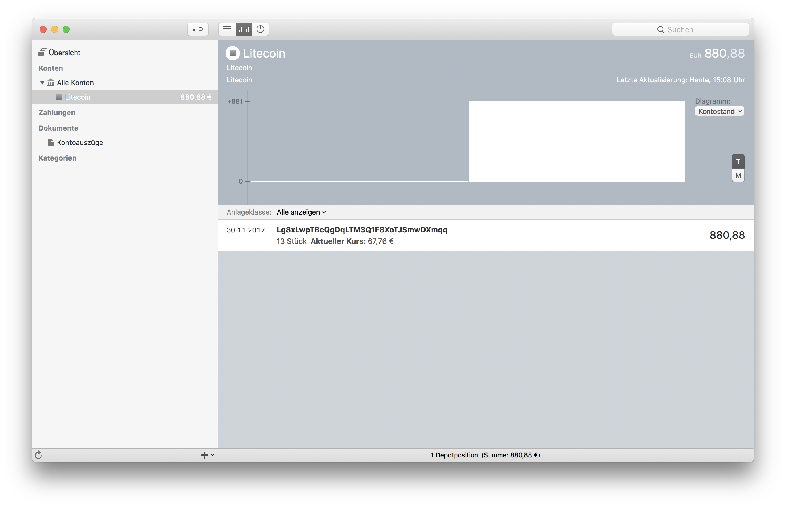

# Litecoin-MoneyMoney
Fetches amount and value of privately held Litecoin address via blockexplorer and returns it as a security.  
This can be also be used to track your cold storage.

## Extension Setup

You can get a signed version of this extension from

* my [GitHub releases page](https://github.com/zafai/Litecoin-MoneyMoney/releases/tag/v0.1), or
* the [MoneyMoney Extensions](https://moneymoney-app.com/extensions/) page

Once downloaded, move `Litecoin.lua` to your MoneyMoney Extensions folder.

**Note:** This extension requires MoneyMoney **Version 2.3.3** or newer.

## MoneyMoney Setup

Add a new account (type "Litecoin"). 

**Use your Litecoin adresses coma seperated as user name**  
`LYK8BKoT5XRH86JyQoiczYvfCuKmQnknbA, LXTU91nPrNFK9CaAFCUgefcr1RddPE7JmT` (example)

**Use whatever you want as password**  
`123` (example)

